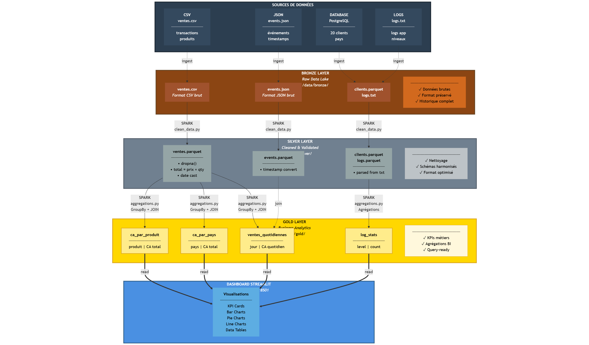

# Big Data Project - Data Pipeline & Visualization

[Lien vers la présentation du projet](https://architecture-big-data-8tn5u4d.gamma.site/)

Ce projet est une démonstration d'un pipeline Big Data complet, de la génération de données brutes à leur visualisation finale via un dashboard interactif. Il utilise l'architecture Medallion (Bronze, Silver, Gold) avec Apache Spark pour le traitement.

## Scénario
Le projet simule un environnement de collecte de données (CSV, JSON, Logs et SQL) qui sont ensuite traitées pour extraire des KPIs métier et visualiser les résultats.

## Architecture Technique


Le projet repose sur une infrastructure conteneurisée via **Docker Compose** :

1.  **data-gen** : Générateur de données Python (`generate_data.py`).
2.  **postgres** : Base de données source simulant un système transactionnel.
3.  **spark** : Moteur de traitement (Apache Spark 3.5) exécutant le pipeline :
    - **Ingestion** : Lecture des sources brutes vers la zone **Bronze**.
    - **Nettoyage** : Transformation des données Bronze vers la zone **Silver** (gestion des doublons, types, quarantaine).
    - **Agrégation** : Calcul des KPIs métier de la zone Silver vers la zone **Gold** au format Parquet.
4.  **streamlit** : Dashboard de visualisation des données finales et suivi de la qualité des données.

## Structure du Projet
```text
├── data/               # Stockage des données (Zones Medallion)
│   ├── source/         # Données brutes générées
│   ├── bronze/         # Données ingérées sans modification
│   ├── silver/         # Données nettoyées
│   ├── gold/           # Agrégations et KPIs finaux
│   └── quarantine/     # Données erronées écartées
├── ingestion/          # Scripts Spark pour l'ingestion initiale
├── spark/              # Scripts Spark pour les transformations
│   ├── clean_data.py   # Nettoyage et passage en Silver
│   ├── aggregations.py # Calculs KPIs et passage en Gold
│   └── run_pipeline_docker.sh # Orchestrateur du pipeline
├── streamlit/          # Code de l'application Dashboard
├── postgres/           # Configuration et scripts SQL
└── docker-compose.yml  # Orchestration des services
```

## Prérequis
- Docker
- Docker Compose

## Lancement du projet

1.  **Cloner le dépôt**
2.  **Démarrer l'infrastructure**
    ```bash
    docker-compose up --build
    ```

Cette commande va automatiquement :
- Générer les données de test.
- Initialiser la base Postgres.
- Lancer le pipeline Spark (Ingestion -> Silver -> Gold).
- Démarrer l'interface Streamlit.

3.  **Accéder au Dashboard**
    Une fois le pipeline terminé, ouvrez votre navigateur à l'adresse suivante :
    [http://localhost:8501](http://localhost:8501)

## Fonctionnalités Clés
- **Validation Strict** : Les données ne respectant pas les schémas sont isolées dans un dossier `quarantine`.
- **Pipeline Automatisé** : L'enchaînement des étapes Spark est géré par un script shell dédié.
- **Visualisation Dynamique** : Dashboard Streamlit permettant de voir les statistiques de vente et les rapports de qualité.
